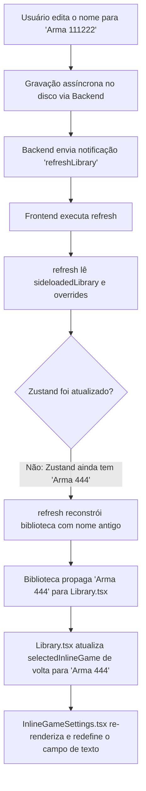

# Roteiro de Verificação: Persistência e Sincronização de Nomes de Jogos

Este documento serve como guia detalhado de como o problema de sincronização de nomes funcionava, o que causava a reversão do nome editado e como você pode realizar testes rigorosos para validar que o bug foi totalmente resolvido.

---

## 🔍 Como o Bug Funcionava (Mecânica Técnica)

No Heroic Games Launcher, o estado da biblioteca de jogos do frontend (**Renderer process**) é mantido em uma instância do `electron-store` (especificamente `sideloadLibrary` e `gameOverridesStore`). O backend (**Main process**) também possui suas próprias instâncias dessas mesmas lojas para gravar os dados em arquivos JSON no disco (`library.json` e `game-overrides.json`).

O loop de reversão que fazia a alteração visual ser cancelada acontecia nos seguintes passos:

Como o **Zustand** (`useGlobalState`) guardava a cópia em memória dos overrides (`gameOverrides`) e essa cópia só era atualizada de forma assíncrona pelo evento de gravação do arquivo do backend (que atrasava ou falhava por conta do sandbox do Chromium no frontend), o fluxo de renderização reativa do React lia o valor desatualizado do Zustand. O gancho de segurança do componente `Library.tsx` interpretava isso como uma alteração legítima de seleção e sobrescrevia o nome editado de volta para a versão antiga.

---

## 🛠️ Como o Bug Foi Resolvido

Implementamos uma sincronização síncrona **imediatamente antes das chamadas de API IPC** em `InlineGameSettings.tsx` e `EditGameDialog/index.tsx`:

1. **Atualização Imediata do Cache em Memória**: O store do frontend (`gameOverridesStore` e `sideloadLibrary`) é atualizado síncronamente na digitação e no unmount.
2. **Atualização do Zustand**: Chamamos **`useGlobalState.getState().setGameOverrides(overrides)`** na hora. Isso garante que a fonte de verdade do Zustand seja atualizada instantaneamente e que o `refresh()` execute sempre com o título corrigido (ex: `"Arma 111222"`), quebrando o loop de reversão reativa.

---

## 📋 Roteiro de Testes para Você Validar com Calma

Aqui está o passo a passo para testar e garantir que o problema não volte a acontecer:

### 🧪 Teste 1: Edição Instantânea e Troca de Foco
1. Abra as **Configurações** de um jogo (ex: um sideloaded).
2. Altere o nome dele no campo de texto (ex: mude de `"Arma"` para `"Arma 111222"`).
3. Sem fechar a aba de configurações, clique em **outro jogo aleatório** na biblioteca (grade da direita).
4. O painel lateral deve carregar o outro jogo.
5. Agora, clique de volta na capa do jogo que você alterou.
6. **Resultado Esperado**: O título deve carregar instantaneamente como `"Arma 111222"`, tanto na barra de título do painel, quanto no campo de texto e na capa.

### 🧪 Teste 2: Fechamento Abrupto (Botão "X")
1. Entre nas configurações do jogo e digite um novo nome.
2. Clique imediatamente no **botão "X"** no canto superior direito para fechar o painel de configurações (isso força a desmontagem abrupta do componente).
3. Selecione qualquer outro jogo e clique de volta.
4. **Resultado Esperado**: O nome editado deve ser persistido perfeitamente (o gancho de `useEffect` de limpeza de desmontagem garantiu a sincronia do cache local).

### 🧪 Teste 3: Reinicialização Completa do Aplicativo
1. Altere o nome de um jogo.
2. Feche o Heroic Games Launcher por completo.
3. Abra o launcher novamente.
4. **Resultado Esperado**: O jogo alterado deve carregar com o novo nome editado, provando que a gravação em disco foi consolidada de forma íntegra.

### 🧪 Teste 4: Edição Tradicional (Via Modal)
1. Clique com o botão direito no card do jogo na biblioteca e selecione **Editar Jogo** (isso abrirá a modal clássica de edição).
2. Altere o título na modal e clique em **Salvar**.
3. Navegue entre outros jogos.
4. **Resultado Esperado**: A modal agora também atualiza o Zustand de forma síncrona, garantindo que o nome permaneça salvo sem sofrer reversão.
